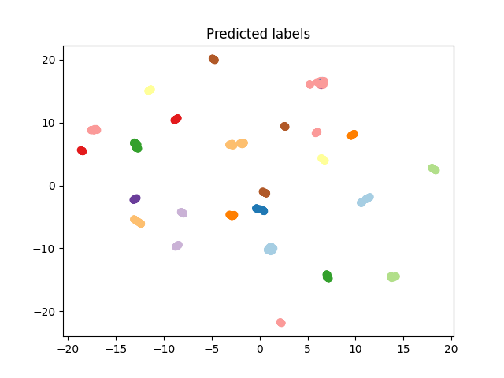

<div align="center">

# Face recognition

</div>

______________________________________________________________________


## Installation and environment

#### Pip

```bash
# clone project
git clone https://github.com/vspavl99/face-recognition.git
cd face-recognition

# install requirements
pip install -r requirements.txt
```

## Dataset
The dataset contain image of people in difference angle and random background photos. 
Each image correspond to certain cluster, which specified in `cluster.csv` file

### Preparing data
Unzipping the data 
```bash
python3 src/data/process_raw_data.py --raw_data_path="<path to raw file.zip>"  --baked_data_dir="<destination folder>"
```

##  Clusters images and evaluating

```bash
python3 src/main.py --path_to_images="<path to dir with images>"  --path_to_target_clusters="<path to file.csv>"
```

Example of working can be founded in `reports/demo.ipynb`

# Results

### Metrics:
`src/main.py` output:

|                    | Background and face images | Face images clustering |
|--------------------|:---------------------------|------------------------|
| V-Measure score    | 0.3965                     | 0.9768                 |
| Homogeneity score  | 0.6129                     | 0.8898                 |
| Completeness score | 0.4815                     | 0.9313                 |


Embeddings projected into 2d space via umap algorithm:
|                         Predictions                          |                        Targets                        |
|:------------------------------------------------------------:|:-----------------------------------------------------:|
|  |  |

### Tuning params
Finding optimal parameters for clustering algorithms
```bash
python3 src/utils/tune_params.py
```

|               | Kmeans <br/>n_cluster | MeanShift  <br/>bandwidth |
|---------------|:-----------------|----------------------|
| optimal value | 25               | 16                   |
