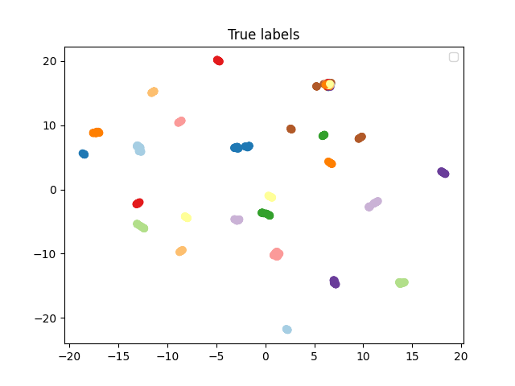

<div align="center">

# Face recognition

</div>

______________________________________________________________________


## Installation and environment

#### Pip

```bash
# clone project
git clone https://github.com/vspavl99/face-recognition.git
cd face-recognition

# install requirements
pip install -r requirements.txt
```

## Dataset
The dataset contain image of people in difference angle and random background photos. 
Each image correspond to certain cluster, which specified in `cluster.csv` file

### Preparing data
Unzipping the data 
```bash
python3 src/data/process_raw_data.py --raw_data_path="<path to raw file.zip>"  --baked_data_dir="<destination folder>"
```

##  Clusters images and evaluating

```bash
python3 src/main.py --path_to_images="<path to dir with images>"  --path_to_target_clusters="<path to file.csv>"
```

# Results
Embeddings projected into 2d space via umap algorithm:
|                         Predictions                          |                        Targets                        |
|:------------------------------------------------------------:|:-----------------------------------------------------:|
|  |  |

### Tuning params
Finding optimal parameters for clustering algorithms
```bash
python3 src/utils/tune_params.py
```
